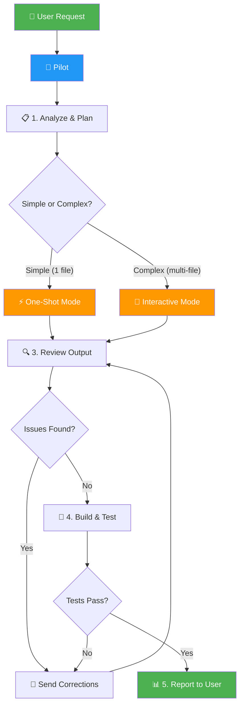

# AI Pilot — Delegation Skill

> **One AI thinks. Another acts.** Like pairing a Tech Lead with a Senior Developer.

## ⚡ Auto-Router — Start Here

**ALWAYS read `SKILL-lite.md` first.** It will auto-detect task complexity and pick the right mode:
- 🟢 Simple → handled entirely in SKILL-lite.md (stop reading this file)
- 🟡 Medium → handled in SKILL-lite.md with spot-check (stop reading this file)
- 🔴 Complex → continue reading this file for full workflow

**Do NOT read this entire file for simple tasks. It wastes tokens.**

---

## Architecture



## Roles

| Role | Who | Responsibility |
|------|-----|----------------|
| 🧠 **Pilot** | Antigravity / Cursor / Cline / Copilot | Analyze → Plan → Delegate → Review → Test → Report |
| ⚡ **Coder** | Claude Code / OpenCode / Aider | Write → Edit → Refactor |

## Supported Pilots

Any AI assistant that can run terminal commands can be the Pilot:

| Pilot | Type | Notes |
|-------|------|-------|
| **Antigravity** | VS Code Extension | Full skill/workflow support |
| **Cursor** | IDE | Use Composer mode for planning |
| **Cline** | VS Code Extension | Autonomous agent capabilities |
| **GitHub Copilot** | VS Code / CLI | Use chat mode for planning |

## Available AI Workers (Coders)

| Worker | Command | Mode | Best For |
|--------|---------|------|----------|
| Claude Code | `claude -p "prompt"` | One-shot | Complex edits, deep understanding |
| Claude Code | `claude` | Interactive | Multi-step tasks, iteration |
| OpenCode | `opencode run "prompt"` | One-shot | Quick tasks, 75+ models |
| OpenCode | `opencode` | Interactive TUI | Complex tasks with UI |
| Aider | `aider --message "prompt"` | One-shot | Git-aware edits, pair programming |
| Aider | `aider` | Interactive | Ongoing development |

---

## Step 1: Analyze & Plan (Pilot)

Before delegating anything:

1. **Understand** the user's request fully
2. **Research** the codebase using `grep_search`, `view_file`, `list_dir`
3. **Identify** all files that need changes
4. **Create a plan** with specific, file-level tasks
5. **Order tasks** by dependency (foundations first)

**Key principle: Never send vague instructions. Always be specific.**

### Decision Tree: When to Delegate

```
Is this task...
├── A simple one-line fix? → Edit directly (don't delegate)
├── A config change? → Edit directly
├── A question about code? → Answer directly
├── A multi-file change? → DELEGATE ✅
├── Complex logic? → DELEGATE ✅
├── Writing tests? → DELEGATE ✅
└── Large refactoring? → DELEGATE ✅
```

---

## Step 2: Delegate to Coder

### Mode Selection

| Situation | Mode | Command Example |
|-----------|------|-----------------|
| Single focused task | One-shot | `claude -p "Add null check to fetchUser()"` |
| Multi-step feature | Interactive | `claude` then send tasks one by one |
| Need git integration | Aider | `aider --message "Refactor auth module"` |
| Want free models | OpenCode | `opencode run "Fix the login bug"` |

### Option A: One-Shot Mode (simple tasks)

```bash
# Claude Code
claude -p "In src/api/user.ts, add null check for user.email on line 42 before calling sendEmail()"

# OpenCode
opencode run "Fix the null pointer exception in auth.ts line 42"

# Aider
aider --message "Add input validation to the signup form in src/components/SignupForm.tsx" --yes
```

### Option B: Interactive Mode (complex tasks)

```bash
# Launch the worker
claude
# or: opencode
# or: aider

# Then send specific instructions via send_command_input (if using from Pilot AI)
```

### Prompt Templates

Use these templates when delegating. Fill in the `[BRACKETS]`:

#### 🐛 Bug Fix
```
BUG FIX REQUEST

File: [FILE_PATH]
Function: [FUNCTION_NAME]
Line: [LINE_NUMBER] (if known)

Current behavior:
[WHAT_HAPPENS_NOW]

Expected behavior:
[WHAT_SHOULD_HAPPEN]

Root cause analysis:
[YOUR_ANALYSIS_OF_WHY]

Fix instructions:
[SPECIFIC_CHANGES_NEEDED]

Constraints:
- Don't modify the public API
- Keep existing tests passing
- Follow the code style in this file
```

#### ✨ New Feature
```
FEATURE REQUEST

Feature: [FEATURE_NAME]
File(s): [FILE_PATH_1], [FILE_PATH_2]

Description:
[WHAT_THE_FEATURE_DOES]

Requirements:
1. [REQUIREMENT_1]
2. [REQUIREMENT_2]
3. [REQUIREMENT_3]

Technical approach:
- Add [WHAT] to [WHERE]
- Follow the pattern used in [REFERENCE_FILE:FUNCTION]
- Use [LIBRARY/API] for [PURPOSE]

Acceptance criteria:
- [ ] [CRITERION_1]
- [ ] [CRITERION_2]
```

#### ♻️ Refactor
```
REFACTOR REQUEST

Target: [FILE_PATH] → [FUNCTION/CLASS/MODULE]

Current issue:
[WHAT'S_WRONG_WITH_CURRENT_CODE]

Goal:
[DESIRED_OUTCOME]

Approach:
[HOW_TO_REFACTOR]

Reference:
See [REFERENCE_FILE] for the pattern to follow.

Constraints:
- Don't change public API / function signatures
- Keep all existing tests passing
- Maintain backward compatibility
```

#### 🔍 Code Review
```
CODE REVIEW REQUEST

Files to review:
- [FILE_1]
- [FILE_2]

Focus areas:
1. Potential bugs or edge cases
2. Security vulnerabilities
3. Performance issues
4. Missing error handling

Output format:
For each finding, provide:
- Severity: CRITICAL / WARNING / INFO
- File and line number
- Description and suggested fix
```

#### 🧪 Write Tests
```
TEST REQUEST

Target: [FUNCTION_NAME] in [FILE_PATH]
Framework: [jest / pytest / XCTest / JUnit / etc.]

Test cases needed:
1. ✅ Happy path: [NORMAL_SCENARIO]
2. ⚠️ Edge case: [BOUNDARY_SCENARIO]
3. ❌ Error case: [FAILURE_SCENARIO]

Reference test: [EXISTING_TEST_FILE] for style/pattern
Output: Write complete test file at [TEST_FILE_PATH]
```

---

## Step 3: Review Output (Pilot)

After the Coder makes changes:

1. **Read modified files** using `view_file`
2. **Check correctness** — Does it solve the problem?
3. **Check style** — Does it match existing patterns?
4. **Check for bugs** — Edge cases, null checks, error handling?
5. **Check scope** — Did it change only what was needed?
6. **Check for regressions** — Could this break other functionality?

If issues found → send corrections back to the Coder:
```
CORRECTION REQUEST

The previous change introduced an issue in [FILE]:
- Problem: [WHAT_WENT_WRONG]
- Expected: [WHAT_SHOULD_BE]
- Fix needed: [SPECIFIC_CORRECTION]

Please fix ONLY this issue without changing other parts.
```

---

## Step 4: Verify & Test (Pilot)

Run appropriate verification commands:

| Platform | Build | Test | Lint |
|----------|-------|------|------|
| iOS | `xcodebuild -scheme [SCHEME] build` | `xcodebuild test` | `swiftlint` |
| Android | `./gradlew assembleDebug` | `./gradlew test` | `./gradlew lint` |
| Web | `npm run build` | `npm test` | `npm run lint` |
| Flutter | `flutter build` | `flutter test` | `flutter analyze` |
| Python | `python -m py_compile` | `pytest` | `ruff check .` |

**Verification Checklist:**
- ✅ Build succeeds with no errors
- ✅ All tests pass (including existing ones)
- ✅ No new lint warnings
- ✅ No regressions in related features
- ✅ Changes match the original plan

---

## Step 5: Report to User

Provide a concise summary using this template:

```markdown
## ✅ Task Completed

**What changed:**
- [File 1]: [Description of change]
- [File 2]: [Description of change]

**Decisions made:**
- [Any design decisions during implementation]

**Test results:**
- Build: ✅ Pass
- Tests: ✅ 42/42 passing
- Lint: ✅ No warnings

**Recommendations:**
- [Any follow-up suggestions]
```

---

## Error Handling

### If Coder makes a mistake:
1. Identify the **specific** error
2. Send a targeted correction (see correction template above)
3. Don't ask the Coder to redo everything — be surgical

### If Coder is stuck:
1. Provide more context (show related files)
2. Break the task into **smaller** sub-tasks
3. Reference specific existing code patterns
4. Consider switching to a different worker

### If build/tests fail:
1. Read the **full** error output
2. Analyze the root cause (don't just forward the error)
3. Send the error message to the Coder **with your analysis**
4. Ask for a targeted fix

### If the task is too large:
1. Stop and re-plan
2. Break into 3-5 smaller tasks
3. Delegate one at a time
4. Review and test between each task

---

## Advanced: Multi-Step Delegation

For complex features that require multiple coordinated changes:

```
Phase 1: Foundation
├── Task 1: Create data models → Delegate → Review → Test
├── Task 2: Add API endpoints → Delegate → Review → Test
└── Checkpoint: Verify foundation works

Phase 2: Business Logic  
├── Task 3: Implement service layer → Delegate → Review → Test
├── Task 4: Add validation → Delegate → Review → Test
└── Checkpoint: Run full test suite

Phase 3: UI & Integration
├── Task 5: Create UI components → Delegate → Review → Test
├── Task 6: Wire up events → Delegate → Review → Test
└── Final: Full regression test
```

**Key Rules:**
- One task per delegation
- Test after each task
- Don't proceed to next phase if current phase has issues
- Log each delegation for tracking

---

## Session Logging

After each delegation, log the session (optional but recommended):

```
[2025-03-24 10:30] worker=claude task="Fix null pointer in auth.ts" status=completed files_changed=1
[2025-03-24 10:45] worker=claude task="Add unit tests for auth" status=completed files_changed=1
[2025-03-24 11:00] worker=opencode task="Update API docs" status=completed files_changed=3
```

Use the CLI: `ai-pilot log` to view recent sessions.

---

## Tips

1. **Always plan first** — Vague prompts produce vague code
2. **One task per delegation** — Keep tasks focused and small
3. **Review everything** — The Coder can and will make mistakes
4. **Include file paths** — Always reference exact paths and function names
5. **Test after each change** — Don't batch untested changes
6. **Use the right tool** — Simple edits → do it directly; Complex → delegate
7. **Provide examples** — Reference existing code patterns for consistency
8. **Iterate** — Send corrections when needed, don't accept mediocre output
9. **Log sessions** — Track what was delegated for future reference
10. **Know when to stop** — If the Coder keeps failing, rethink your approach
