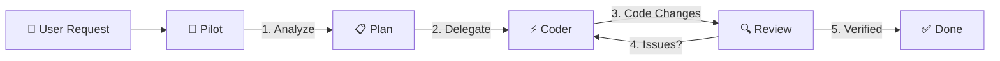

# 🤖 AI Pilot

[](LICENSE)
[](https://github.com/manhpd98/ai-pilot)
[](CHANGELOG.md)
[](CONTRIBUTING.md)

> **Multi-Agent Coding Workflow** — Use one AI to plan, review, and verify while another writes the code. Like pairing a Tech Lead with a Senior Developer.

## The Problem

Using a single AI for everything creates a bottleneck. It plans, writes, reviews, and tests — all in one context. The result? Unfocused output, missed bugs, and self-reviewed code.

## The Solution

**Split the roles.** One AI thinks. Another acts.



| Role | Tool | Responsibility |
|------|------|----------------|
| 🧠 **Pilot** | Antigravity / Cursor / Cline | Analyze → Plan → Review → Test → Report |
| ⚡ **Coder** | Claude Code / OpenCode / Aider | Write → Edit → Refactor |

## Quick Start

### Option A: One-line install

```bash
curl -fsSL https://raw.githubusercontent.com/manhpd98/ai-pilot/main/install.sh | bash
```

### Option B: Manual install

```bash
git clone https://github.com/manhpd98/ai-pilot.git
cp -r ai-pilot/.agent /path/to/your/project/
```

### Option C: CLI tool

```bash
# Clone and add to PATH
git clone https://github.com/manhpd98/ai-pilot.git
export PATH="$PATH:$(pwd)/ai-pilot/bin"

# Initialize in any project
cd /path/to/your/project
ai-pilot init
```

### Install an AI Worker

```bash
# Claude Code — requires Claude Pro/Max subscription
npm install -g @anthropic-ai/claude-code

# OpenCode — free, supports 75+ AI models
curl -fsSL https://opencode.ai/install | bash

# Aider — open source, bring your own API key
pip install aider-chat
```

### Start Using It

Tell your Pilot AI what you need:

> _"Fix the login crash — delegate coding to Claude Code"_

AI Pilot automatically:

1. 📋 Analyzes your codebase
2. 🗺️ Creates an implementation plan
3. ⚡ Delegates coding to the worker
4. 🔍 Reviews all changes
5. ✅ Runs tests & verifies
6. 📊 Reports results

## CLI Usage

```bash
ai-pilot init                                        # Install .agent/ in current project
ai-pilot delegate claude "Fix login bug"             # Delegate task to Claude Code
ai-pilot delegate aider "Add dark mode"              # Delegate task to Aider
ai-pilot review src/api/user.ts                      # Run AI code review
ai-pilot review --worker claude src/api/user.ts      # Review using a specific worker
ai-pilot status                                      # Check installed workers
ai-pilot log                                         # View delegation history
ai-pilot update                                      # Pull latest .agent/ from GitHub
ai-pilot uninstall                                   # Remove .agent/ from project
ai-pilot help                                        # Show help and available commands
```

## CLI Commands

| Command | Description |
|---------|-------------|
| `ai-pilot init` | Installs the `.agent/` directory into the current project. Safe to re-run — won't overwrite existing files. |
| `ai-pilot delegate <worker> "<task>"` | Delegates a coding task to the specified worker (claude, opencode, aider). |
| `ai-pilot review [--worker <name>] [files...]` | Runs AI code review on specified files or staged changes. Use `--worker` to pick which AI performs the review. |
| `ai-pilot status` | Shows which AI workers are installed and available on your system. |
| `ai-pilot log` | Displays delegation session history and past results. |
| `ai-pilot update` | Pulls the latest `.agent/` skills and workflows from GitHub. Shows a summary of what changed. |
| `ai-pilot uninstall` | Removes `.agent/` from the project. Prompts for confirmation and optionally cleans up logs. |
| `ai-pilot help` | Prints usage information and lists all available commands. |

## What's Inside

```
.agent/
├── skills/
│   └── ai-delegation/
│       ├── SKILL.md                       # Core delegation logic & prompt templates
│       ├── SKILL-lite.md                  # Lightweight version for quick reference
│       └── session-log-template.md        # Session logging format
└── workflows/
    ├── delegate-claude.md                 # Claude Code workflow
    ├── delegate-opencode.md               # OpenCode workflow
    ├── delegate-aider.md                  # Aider workflow
    ├── quick-delegate.md                  # Quick delegation shortcut
    ├── code-review.md                     # AI code review pipeline
    └── debug.md                           # Structured debugging flow

bin/
└── ai-pilot                               # CLI tool

templates/
├── prompt-templates.md                    # Ready-to-use prompts for any task
└── project-configs/                       # Platform-specific configs
    ├── ios.md                             #   iOS / Swift / Xcode
    ├── android.md                         #   Android / Kotlin / Gradle
    ├── web.md                             #   Web / React / Next.js
    ├── flutter.md                         #   Flutter / Dart
    └── python.md                          #   Python / FastAPI / Django

examples/
├── fix-bug.md                             # Real example with code diffs
├── add-feature.md                         # Multi-task delegation walkthrough
└── refactor.md                            # MVVM refactor with metrics
```

## Why Multi-Agent?

| | Single AI | AI Pilot (Multi-Agent) |
|---|---|---|
| **Planning** | Same context as coding | Dedicated analysis & planning |
| **Code Quality** | Self-reviews own work | Independent review by different AI |
| **Verification** | Often skipped | Systematic testing after every change |
| **Complex Tasks** | Context gets muddled | Clear task delegation & tracking |
| **Error Recovery** | Keeps going | Catches issues & sends corrections |
| **Accountability** | No trail | Session logging & history |

## Supported Pilots

Any AI that can run terminal commands:

| Pilot | Type | Notes |
|-------|------|-------|
| [Antigravity](https://antigravity.dev) | VS Code Extension | Full skill/workflow support |
| [Cursor](https://cursor.sh) | IDE | Use Composer for planning |
| [Cline](https://cline.bot) | VS Code Extension | Autonomous agent |
| [GitHub Copilot](https://github.com/features/copilot) | VS Code / CLI | Chat mode for planning |

## Supported AI Workers (Coders)

| Worker | Command | Auth | Best For |
|--------|---------|------|----------|
| [Claude Code](https://www.anthropic.com/claude-code) | `claude` | Claude Pro/Max | Complex refactoring, multi-file edits |
| [OpenCode](https://opencode.ai) | `opencode` | Free / BYO key | Quick tasks, 75+ AI providers |
| [Aider](https://aider.chat) | `aider` | BYO API key | Git-aware edits, pair programming |

## Real-World Examples

Each example includes actual prompts, code diffs, and terminal output:

- 🐛 **[Fix a Bug](examples/fix-bug.md)** — Crash fix with surgical delegation (~3 min)
- ✨ **[Add a Feature](examples/add-feature.md)** — Dark mode with 3-task delegation (~8 min)
- ♻️ **[Refactor Code](examples/refactor.md)** — 800→200 line ViewController refactor (~12 min)

## FAQ

<details>
<summary><b>Do I need Antigravity specifically?</b></summary>
No. Any AI assistant that can run terminal commands can be the Pilot. Antigravity has native skill/workflow support, but Cursor, Cline, and GitHub Copilot all work.
</details>

<details>
<summary><b>Is this free?</b></summary>
AI Pilot itself is free (MIT license). Workers may have costs: Claude Code needs Claude Pro ($20/mo), OpenCode includes free models, Aider uses your own API keys.
</details>

<details>
<summary><b>Can I use multiple workers?</b></summary>
Yes. Use Claude Code for complex tasks and OpenCode/Aider for quick fixes. The CLI supports switching: <code>ai-pilot delegate claude "..."</code> vs <code>ai-pilot delegate aider "..."</code>
</details>

<details>
<summary><b>Does this work with my language/framework?</b></summary>
Yes. AI Pilot is language-agnostic. It includes platform configs for iOS, Android, Web, Flutter, and Python, but works with any tech stack.
</details>

<details>
<summary><b>How is this different from just using Claude Code directly?</b></summary>
When you use Claude Code alone, it plans AND codes in the same context. AI Pilot separates these roles so the Pilot can focus on planning and review while the Coder focuses on implementation. The result is better code quality and fewer missed bugs.
</details>

## Documentation

- 📖 [Getting Started](docs/getting-started.md) — Full setup guide
- 💡 [Best Practices](docs/best-practices.md) — Tips & anti-patterns
- 📝 [Prompt Templates](templates/prompt-templates.md) — Ready-to-use prompts
- 🔧 [Supported Workers](docs/supported-workers.md) — All compatible AI tools
- 📂 [Examples](examples/) — Real-world walkthroughs with code diffs
- 🇻🇳 [Hướng Dẫn Tiếng Việt](docs/huong-dan-su-dung.md) — Vietnamese guide

## Contributing

PRs welcome! See [CONTRIBUTING.md](CONTRIBUTING.md) for guidelines.

Areas we'd love help with:
- New AI worker integrations
- Platform-specific configs for more frameworks
- More real-world examples with code diffs
- Translations
- CLI improvements

## License

[MIT](LICENSE) — Use freely in any project.
